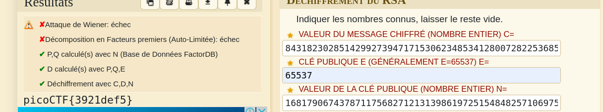

**RSA cipher ?**
A la lecture du code associé **gen.py** associé au challenge, on a l'impression de faire un reverse du code.
Mais ne cherchons pas loin. 

_Rendez-vous sur [/www.dcode.fr](https://www.dcode.fr/chiffre-rsa)_

Les valeurs données sont en hexadécimales.

Convertissez les essayons le décodage avec dcode.

Et bingooooooo !!! Le falg est là...

