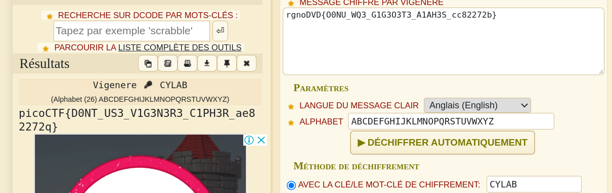

**Vigenere cipher ?**

Une petite recherche nous amène à une compréhension minimum de la méthode de chiffrement.

Rendez-vous sur [dcode](https://www.dcode.fr/chiffre-vigenere)

Remplissez les champs...

N'oubliez pas le mot clé _CYLAB_

Bingoooo !!!

