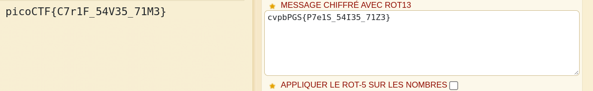

L'énocé dit que les noms des utilisateurs dans le fichier usernames.txt correspondent dans le même ordre aux mots de passes dans le fichier passwords.txt

Allons donc à la recherche de la position de **cultiris** dans le fichier usernames.txt.

Utilisons la commande grep:

`grep -n cultiris leak/usernames.txt `

Celle-ci donne la ligne 378

Allons à la recherche du mot de passe correspondant:

`head -n378 leak/passwords.txt | tail -n1 `

_cvpbPGS{P7e1S_54I35_71Z3}_

Il s'agit de rot13, avec [dcode.fr ](https://www.dcode.fr/) nous trouvons le flag.

Bravo !!!

