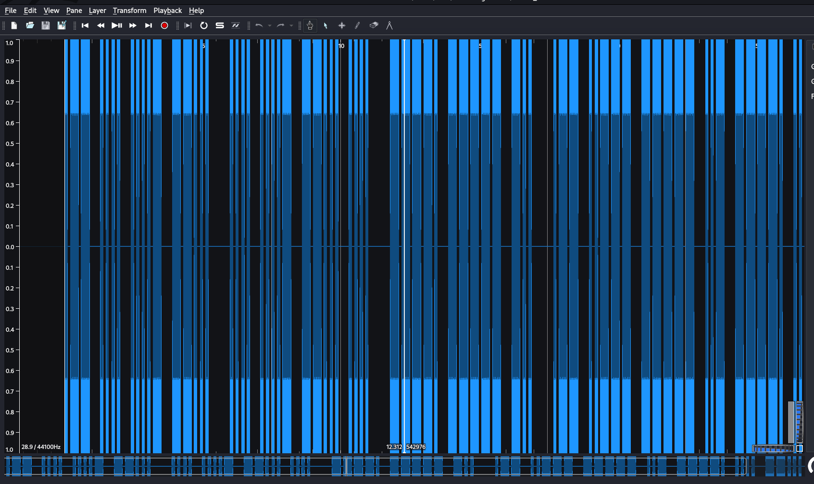
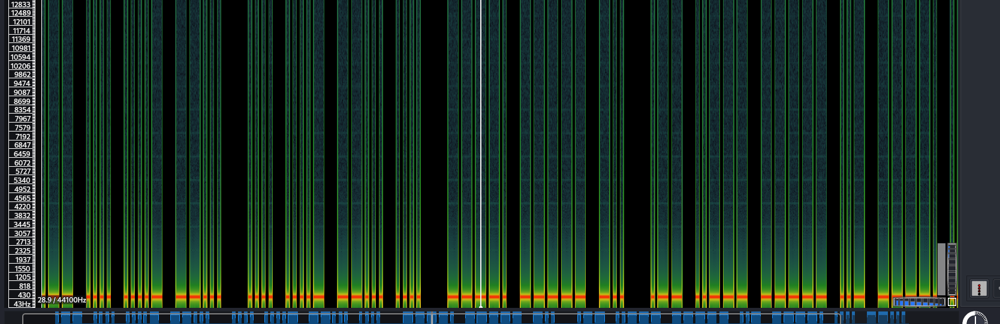

**morse-code ?**

Le nom du challenge nous revèle qu'il s'agit de morse-code.

Connaissez vous  morse-code  ?

Le fameux chiffrement remplis de . et de - ?

Il y a des outils de lecture des caratères de morse comme vous pouvez le faire à laide de sonic visualiser.

Voyons avec les outils en ligne:

**morse-code ?**

Le nom du challenge nous revèle qu'il s'agit de morse-code.

Connaissez vous  morse-code  ?

Le fameux chiffrement remplis de . et de - ?

Il y a des outils de lecture des caratères de morse comme vous pouvez le faire à laide de sonic visualiser.

Voyons avec les outils en ligne:

on obtient ce ci _em_h47_h47h_90d_w20u9h7_ en remplaçant les espaces par _ et le tout en minuscule...

Ce qui n'est pas le bon flag.

Retour à la methode manuelle:

J'ai utilisé dans le présent cas sonic.

A l'ouverture du fichier avec sonic, vous avez quelques chose comme ceci:

Ajouter le spectogramme sous le _menu layer_

Vous avez actuellement quelque chose comme ceci:

La partie qui nous intèresse est celle en bas collorée en vert façon..

Pour le décodage, un petit trait represente un point et un gros un tiret, les espaces vide marquent la fin d'un caractère, les doubles espaces marquent la fin d'un mot.

Decoder avec [CyberChef](https://gchq.github.io/CyberChef/#recipe=From_Morse_Code), on a : 

Remontons au code de sonic et identions les mots. Les espaces vides seront remplacés par `_`

