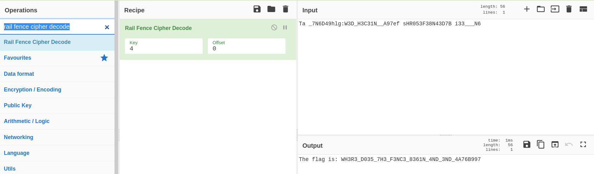

**rail-fence ?**

Le bon hacker commence toujours par une reconnaissance de sa cible, :) 

À la reconnaissance ...

[wikipedia.org](https://en.wikipedia.org/wiki/Rail_fence_cipher) explique clairement ce chiffrement. 

Mais comme nous n'aimons pas trop retarder sur les choses, nous allons utiliser un outil en ligne.

Il s'agit de [CyberChef](https://gchq.github.io/CyberChef/#recipe=Rail_Fence_Cipher_Decode)

Choisissez _rail fence cipher decode_ et coller le text sans oublier le rail ( 4 ).

Bingoooo !!!

 
