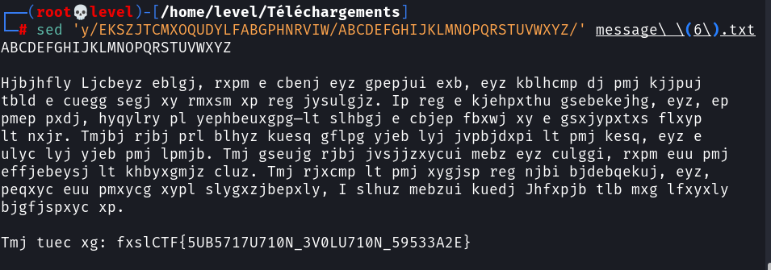
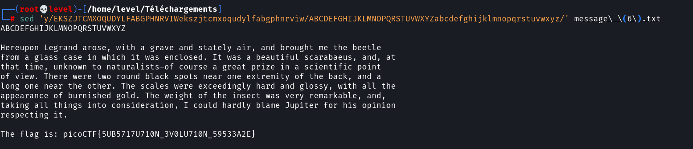

**Substitution ?**

Le nom du challenge nous indique qu'il sagit de Substitution.

Au debut du  fichier, nous voyons les 26  lettres alphabétiques ordonnées dans un ordre différent du standard.

Cela pourvait être l'ordre de remplacement des caractères.

Essaiyons pour voir ! 

`sed 'y/EKSZJTCMXOQUDYLFABGPHNRVIW/ABCDEFGHIJKLMNOPQRSTUVWXYZ/' message.txt`

Cette commande remplacera les caratères, l'un par l'autre de façons symétrique par rapport au deuxième **/**

On obtient:

On constate que seuls les caractères majuscules sont prises en compte.
Complètons les minuscules.

`sed 'y/EKSZJTCMXOQUDYLFABGPHNRVIWekszjtcmxoqudylfabgphnrviw/ABCDEFGHIJKLMNOPQRSTUVWXYZabcdefghijklmnopqrstuvwxyz/' message.txt`

Bravo !!!
