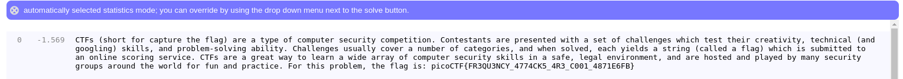

**Encore substitution ?**

Cette fois ci, il n'y a pas l'ordre de remplacement.
L'un des hints nous indique d'essaiyer d'attaque.
Pour vite y aller, utilisont un outil en ligne.
Il s'agit de [www.quipqiup](https://www.quipqiup.com/)

La première tantative de l'outil revèle le flag

picoCTF{FR3QU3NCY_4774CK5_4R3_C001_4871E6FB}
