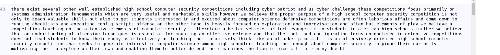

**Encore et à nouveau substitution !!!**

Comme nous n'avons pas d'indice sur l'ordre des caractères substitués, nous allons essayer d'attaque sur le message.

Nous utilisons [www.quipqiup.com](https://www.quipqiup.com/)

Nous obtenons: 

Le flag n'est pas au complet, il parait que l'outil ne gère pas les chiffres, nous les complètons et on à le flag.

Bravooo !!!
