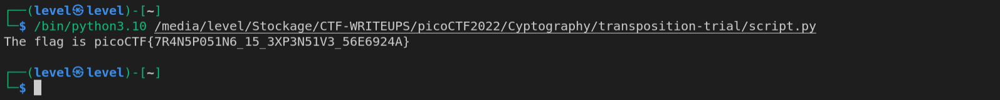

**transposition-trial**
Le nom nous indique qu'il s'agit d'une tri-transposition.

Aussi le hint (astuces) nous demande de decouper les mots par caratètres de trois et voir...

Nous savons que la dernière phrase serait quelque chose comme:

`The flag is picoCTF{flag}`

Essayons de décripter à présent le message:

heTfl g as iicpCTo{7F4NRP051N5_16_35P3X51N3_V6E5926A}4

`The` vs `heT`

`fl ` vs ` fl`

`ag ` vs `g a`

Notez bien que les espaces vide sont comptés comme un caratère.

On remaque de cela que la première lettre du trio est envoyée à la fin du mot (le trio)

L'inverse de ce jeu nous donne le flag.

Nous pouvons automatiser la tâche avec un script python.

Bingo !!!

